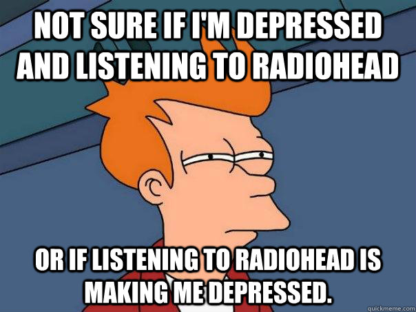

```{r setup, include=FALSE}
knitr::opts_chunk$set(echo = TRUE)
```

# Tråkig bakgrundsfakta `r emo::ji("tired")`
--
```{r, out.width = "400px", echo=FALSE, fig.align='center'}

```

---
```{r, out.width = "250px", echo=FALSE, fig.align='center'}
knitr::include_graphics("libs/images/R_logo.svg.png")
```
--
<center> <h1>+</h1> </center>
```{r, out.width = "250px", echo=FALSE, fig.align='center'}
knitr::include_graphics("libs/images/tidyverse.png")
```
---

# Gloom Index
--
```{r, out.width = "600px", echo=FALSE, fig.align='center'}

```
---
```{r, out.width = "400px", echo=FALSE, fig.align='center'}
knitr::include_graphics("libs/images/spotify.png")
```

<center> <h1>+ `r emo::ji("sad")` words</h1> </center>
---
# Data från Spotify
--
```{r, eval=FALSE}
library(spotifyr)
kent_df <- get_artist_audio_features("kent")
```
```{r echo=FALSE, message=FALSE, warning=FALSE}
library(dplyr)
kent_df <- read.table("/Users/filipwastberg/Github/dataland/kent_df.txt")
kent_df$track_name <- as.character(kent_df$track_name)
```
--
```{r}
kent_df %>%
  select(album_name, track_name, valence:duration_ms, key_mode) %>%
  head()
```
---
# Text från Genius
--
```{r eval=FALSE}
library(tidyverse)
library(httr)
token <- "xxxxxxxxxxxxxxxxxxx"

genius_get_artists <- function(artist_name, n_results = 10) {
    baseURL <- 'https://api.genius.com/search?q=' 
    requestURL <- paste0(baseURL, gsub(' ', '%20', artist_name),
                         '&per_page=', n_results,
                         '&access_token=', token)
    
    res <- GET(requestURL) %>% content %>%
      .$response %>% .$hits
    
    map_df(1:length(res), function(x) {
        tmp <- res[[x]]$result$primary_artist
        list(
            artist_id = tmp$id,
            artist_name = tmp$name
        )
    }) %>% unique
}
```
---
# Ladda ner URL:s
--
```{r message=FALSE, eval=FALSE}
baseURL <- 'https://api.genius.com/artists/' 
requestURL <- paste0(baseURL, genius_artists$artist_id[1], '/songs')
 
track_lyric_urls <- list()
i <- 1
while (i > 0) {
  tmp <- GET(requestURL,
             query = list(access_token = token,
                          per_page = 50, page = i)) %>% 
    content %>% 
    .$response
  track_lyric_urls <- c(track_lyric_urls, tmp$songs)
  if (!is.null(tmp$next_page)) {
    i <- tmp$next_page
  } else {
    break
  }
}
```
---
# Ladda ner texterna
--
```{r eval = FALSE}
library(rvest)
library(stringr)

lyric_scraper <- function(url) {
  read_html(url) %>% 
    html_node('p') %>% 
    html_text()
}
```
---
# Ladda ner texterna 
--
```{r eval = FALSE}
genius_df <- map_df(1:length(track_lyric_urls), function(x) {
 
  lyrics <- try(lyric_scraper(track_lyric_urls[[x]]$url))
  if (class(lyrics) != 'try-error') {
    # Här görs textredigeringarna
    lyrics <- str_replace_all(lyrics, '\\[(Verse [[:digit:]]|Pre-Chorus [[:digit:]]|Hook [[:digit:]]|Chorus|Outro|Verse|Refrain|Hook|Bridge|Intro|Instrumental)\\]|[[:digit:]]|[\\.!?\\(\\)\\[\\],]', '')
    lyrics <- str_replace_all(lyrics, '\\n', ' ')
    lyrics <- str_replace_all(lyrics, '([A-Z])', ' \\1')
    lyrics <- str_replace_all(lyrics, ' {2,}', ' ')
    lyrics <- tolower(str_trim(lyrics))
  } else {
    lyrics <- NA
  }
  
  tots <- list(
    track_name = track_lyric_urls[[x]]$title,
    lyrics = lyrics
  )
  return(tots)
})
```
---
# Slå samman data
--
```{r eval = FALSE}
genius_df_rens <- genius_df %>%
  mutate(track_name = tolower(str_replace(track_name, '[[:punct:]]', ''))) %>%
  filter(!duplicated(track_name))
```
---
# Slå samman data
--
```{r eval = FALSE}
track_df <- kent_df %>%
  mutate(track_name = tolower(
    str_replace(track_name, '[[:punct:]]', ''))) %>%
  left_join(genius_df_rens, by = 'track_name') %>%
  select(track_name, valence, duration_ms,
         lyrics, album_name, album_release_year, album_img)
```
```{r echo=FALSE, message=FALSE, warning=FALSE}
library(tidytext)
track_df <- read.table("/Users/filipwastberg/Github/dataland/track_df.txt")
```
---
# PROBLEM `r emo::ji("scream")`
- Genius API = Wikipedia för musiktexter
--
- Ambitiösa fans
---
# Lösning
--
```{r eval=FALSE}
kent_nu <- function(song){
  lyrics <- read_html(paste("http://kent.nu/latar/", song)) %>%
    html_nodes(xpath="//h2[contains(., 'Text')]/following-sibling::p") %>%
    html_text() %>%
    paste0(collapse = " ")
  lyrics <- str_replace_all(lyrics, '\\n', ' ')
  lyrics <- str_replace_all(lyrics, '([A-Z])', ' \\1')
  lyrics <- str_replace_all(lyrics, ' {2,}', ' ')
  lyrics <- tolower(str_trim(lyrics))
  return(lyrics)
}
```
---
# Problem nr 2 `r emo::ji("upset")`
- Vissa av låtarna finns bara på engelska (Just Like Money, Velvet m.fl)
-- 
- Räddningen: paketet *textcat* `r emo::ji("cat")`
```{r eval=FALSE}
library(textcat)
track_df <- track_df %>%
  filter(textcat(lyrics) == "swedish")
```
---
# Analysen kan börja!
--
```{r}
track_df %>%
  select(track_name, valence) %>%
  arrange(valence) %>%
  head(10)
```
---
# Andel negativa ord
- Paketet rlexsent 
--

```{r}
library(rlexswesent)
data("swesent", package = "rlexswesent")

neg_ord <- swesent %>%
  filter(polarity == "neg") %>%
  mutate(neg = 1) %>%
  select(word, neg, strength, confidence)
```
--
```{r}
head(neg_ord)
```
---
## Tidytext och tm 
--
```{r warning=FALSE, message=FALSE}
library(tidytext)
library(tm)

stop_words_df <- data.frame(word = as.character(stopwords(kind = "sv")))
track_df$lyrics <- as.character(track_df$lyrics)

sent_df <- track_df %>% 
  unnest_tokens(word, lyrics) %>%
  anti_join(stop_words_df, by = 'word') %>%
  left_join(neg_ord, by = 'word')
```
---

# Räkna ut procent depp
--
```{r}
sent_df_neg <- sent_df %>%
  group_by(track_name) %>% 
  summarise(pct_depp = round(
    sum(
      neg*strength*confidence*-1,
      na.rm = T)/ n(), 4),
            word_count = n()) %>% 
  ungroup

head(sent_df_neg)
```
---
# Nu finns allt som behövs
- Vad är vårt depp-index?
--
$$DeppIndex=\frac{(1-valence) + procentDepp}{2}$$

---
# Skapa depp-index
```{r}
library(scales)
track_df_depp <- track_df %>% 
  left_join(sent_df_neg, by = 'track_name') %>% 
  mutate_at(c('pct_depp', 'word_count'),
            funs(ifelse(is.na(.), 0, .))) %>% 
  mutate(deppindex = 
           round(rescale(1 - ((1 - valence) + (pct_depp)) / 2,
                         to = c(1, 100)), 2))
```
--
```{r}
depp_table <- track_df_depp %>%
  select(deppindex, track_name) %>%
  arrange(deppindex) %>%
  head(10) %>%
  htmlTable::htmlTable(header = c("Depp-index", "Låt"))
```
---
# Voila `r emo::ji("v")`
```{r}
depp_table
```
---
# Sista putset inför visualisering
```{r warning=FALSE, message=FALSE}
depp_per_år <- track_df_depp %>%
  group_by(album_release_year, album_name) %>%
  summarise(Medeldepp = round(mean(deppindex), 2))

track_df_depp <- left_join(track_df_depp, depp_per_år)
```
---
# `plotly` för visualisering
```{r, warning=FALSE, message=FALSE}
library(plotly)
p_depp <- track_df_depp %>% 
  plot_ly(x = ~as.Date(substr(album_release_year, 1, 4), format = "%Y"),
          y = ~deppindex,
          hoverinfo = 'text',
          text = ~paste('Album: ', album_name,
                        '<br> Låt: ', track_name,
                        '<br> Depp-index: ', deppindex,
                        '<br>År: ', album_release_year)) %>%
  add_markers(color = ~album_name) %>%
  add_lines(y =~Medeldepp,
            text = ~paste('Album:', album_name,
                          '<br>Medeldepp: ', round(Medeldepp,2))) %>%
    layout(title = "Kents mest deprimerande låtar 1995-2016",
    showlegend = FALSE, 
         yaxis = list(title = "Depp-index"),
         xaxis = list(title = "", tickformat = "%Y"))
```

---
```{r, out.width = "1000px",  warning=FALSE, message=FALSE, fig.align='center'}
p_depp
```
---
# Slutkläm
```{r, out.width = "600px", echo=FALSE, fig.align='center'}
knitr::include_graphics("libs/images/public-relations.png")
```